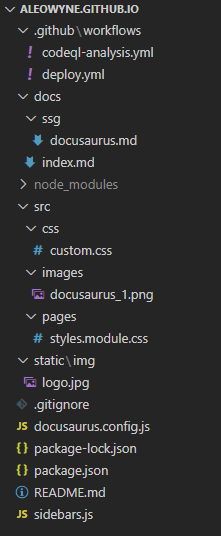

# Docusaurus 2

## 1. Présentation de Docusaurus
[Docusaurus 2](https://v2.docusaurus.io/) est un générateur de site web statique.  
Il est particulièrement utilisé pour générer des sites de documentation, mais il est possible de créer n'importe quel type de site web statique. Docusaurus est construit avec React et peut être customisé selon les besoins.  

Le contenu de votre site est rédigé grâce à la syntaxe markdown (md et mdx).  
Un [moteur de recherche](https://v2.docusaurus.io/docs/search/) basé sur Algolia ou Typesense peut être installé sur votre site. Il est également possible de mettre en place une recherche locale grâce à des plugins.  
Le [style](https://v2.docusaurus.io/docs/styling-layout/#styling-your-site-with-infima) du site peut également être modifié avec [Infima](https://facebookincubator.github.io/infima/).  
Votre site peut être traduit dans plusieurs langues.  
La documentation peut être synchronisée avec les différentes versions d’un projet.

<br/>

## 2. Installation d'un nouveau projet Docusaurus
En prérequis, Node.js, avec une version 16.14 ou supérieure, doit être installé. Si vous le souhaitez, vous pouvez utiliser Yarn pour la gestion des packages.

Création d'un nouveau projet avec le template classic proposé par Docusaurus :
```bash
npm init docusaurus
```

Le projet a la structure suivante :
- Dossier `blog` qui contient tous les articles du blog au format markdown
- Dossier `docs` qui contient les fichiers de la documentation au format markdown
- Dossier `src/css` qui contient les fichiers de style css
- Dossier `src/pages` qui contient les pages de premier niveau du site - [Création de pages](https://v2.docusaurus.io/docs/creating-pages/)
- Dossier `static/img` qui contient les images du site
- Fichier `docusaurus.config.js` qui contient la configuration du site
- Fichier `sidebars.js` qui contient le menu latéral de la documentation

Exécution locale du site sur le serveur de développement qui affichera automatiquement le site à l'adresse http://localhost:3000 dans votre navigateur préféré : 
```bash
npm start
```

Création de la version statique du site dans le dossier `build`, puis affichage dans le navigateur :
```bash
npm run build
npm run serve
```

<br/>

## 3. Customisation du projet
### 3.1 Configuration globale du projet
A la création d'un nouveau projet, trois parties sont disponibles dans le menu du site : la page d'accueil du site, la documentation et le blog.  
Sur mon blog-notes, la page d'accueil (fichier `src/pages/index.js`) et le dossier blog ont été supprimées pour n'avoir que la documentation.

Modification du fichier `docusaurus.config.js` pour que la page principale du site pointe vers le contenu du fichier `index.md` présent dans les docs :
```javascript {7-8} title="docusaurus.config.js"
  ...
  presets: [
    [
      '@docusaurus/preset-classic',
      {
        docs: {
          routeBasePath: '/',
          sidebarPath: require.resolve('./sidebars.js'),
          showLastUpdateAuthor: true,
          showLastUpdateTime: true,
        },
        theme: {
          customCss: require.resolve('./src/css/custom.css'),
        },
      },
    ],
  ],
  ...
```
<p align="center">

   
***Architecture du projet***
</p>

<br/>

### 3.2 Menu latéral de la documentation
Le fichier `sidebars.js` permet de gérer le menu latéral de la documentation. Il peut y avoir plusieurs menus latéraux dans ce fichier.  
Sur le projet, la sidebar est générée automatiquement.

```javascript title="sidebars.js"
module.exports = {
  docs: [
    "index",
    {
      type: "category",
      label: "Générateurs de site statique",
      items: [
        {
          type: "autogenerated", dirName: "ssg"
        }
      ]
    },
  ]
};
```

<br/>

### 3.3 Modification du fichier de style
Pour générer les couleurs primaires du site, un [outil](https://v2.docusaurus.io/docs/styling-layout#styling-your-site-with-infima) est disponible sur le site de Docusaurus.

Exemple :
- En mode clair, la couleur primaire est orientée vers le bleu
- En mode sombre, la couleur primaire est plutôt orientée vers le vert et la couleur du fond est grise plutôt que noire.

```css title="src/css/custom.css"
:root {
  --ifm-code-font-size: 95%;
  --ifm-container-width: 1500px;
  --ifm-color-primary: #1c5b9b;
  --ifm-color-primary-dark: #19528b;
  --ifm-color-primary-darker: #184d84;
  --ifm-color-primary-darkest: #14406d;
  --ifm-color-primary-light: #1f64aa;
  --ifm-color-primary-lighter: #2069b2;
  --ifm-color-primary-lightest: #2476ca;
}

html[data-theme='dark'] {
  --ifm-color-content: #bbc2cf;
  --ifm-color-primary: #2ede32;
  --ifm-color-primary-dark: #21d025;
  --ifm-color-primary-darker: #1fc523;
  --ifm-color-primary-darkest: #1aa21d;
  --ifm-color-primary-light: #45e249;
  --ifm-color-primary-lighter: #51e354;
  --ifm-color-primary-lightest: #73e976;
  --ifm-background-color: #15202b;
}
```

<br/>

### 3.4 Mise en place d’une recherche locale
Sur le blog-notes, une recherche locale a été mise en place avec le plugin [@easyops-cn/docusaurus-search-local](https://github.com/easyops-cn/docusaurus-search-local).

Installation du plugin :
```bash
npm install --save @easyops-cn/docusaurus-search-local
```

Modification du fichier `docusaurus.config.js` :
```javascript title="docusaurus.config.js"
module.exports = {
  ...
  themes: [
    [
      require.resolve("@easyops-cn/docusaurus-search-local"),
      ({
        docsRouteBasePath: "/",
        hashed: true,
        language: ["fr"],
      }),
    ],
  ],
  ...
}
```

<br/>

## 4. Déploiement du projet avec GitHub Pages
Le dépôt GitHub `username.github.io` doit être créé au préalable.  
Sur le projet, un déploiement automatique a été mis en place avec les actions GitHub, pour que le build soit effectué lors d’un push sur le dépôt GitHub.

1. Dans le dossier du projet Docusaurus, initialisation d'un dépôt git
```bash
cd mon_site
git init
``` 
<br/>

2. Création d'une connexion avec le dépôt distant GitHub
```bash
git remote add origin https://github.com/username/username.github.io
```
<br/>

3. Création de deux branches `dev` et `gh-pages` avec la branche `dev` définie par défaut.

La branche `gh-pages` contiendra le code généré du site statique et la branche `dev` contiendra le code source du site statique.
```bash
git checkout gh-pages
git checkout -b dev
```
<br/>

4. Création d’un fichier `deploy.yml` dans le dossier `.github/workflows`
```yaml title="deploy.yml"
name: Deploy to GitHub Pages

on:
  push:
    branches:
      - dev
    # Review gh actions docs if you want to further define triggers, paths, etc
    # https://docs.github.com/en/actions/using-workflows/workflow-syntax-for-github-actions#on

jobs:
  deploy:
    name: Deploy to GitHub Pages
    runs-on: ubuntu-latest
    steps:
      - uses: actions/checkout@v3
      - uses: actions/setup-node@v3
        with:
          node-version: 18
          cache: npm

      - name: Install dependencies
        run: npm ci
      - name: Build website
        run: npm run build

      # Popular action to deploy to GitHub Pages:
      # Docs: https://github.com/peaceiris/actions-gh-pages#%EF%B8%8F-docusaurus
      - name: Deploy to GitHub Pages
        uses: peaceiris/actions-gh-pages@v3
        with:
          github_token: ${{ secrets.GITHUB_TOKEN }}
          # Build output to publish to the `gh-pages` branch:
          publish_dir: ./build
          # The following lines assign commit authorship to the official
          # GH-Actions bot for deploys to `gh-pages` branch:
          # https://github.com/actions/checkout/issues/13#issuecomment-724415212
          # The GH actions bot is used by default if you didn't specify the two fields.
          # You can swap them out with your own user credentials.
          user_name: github-actions[bot]
          user_email: 41898282+github-actions[bot]@users.noreply.github.com
```
<br/>

5. Push des modifications sur le GitHub et déploiement automatique sur l’URL https://username.github.io
```bash
git add .
git commit -m "Message du commit"
git push
```
