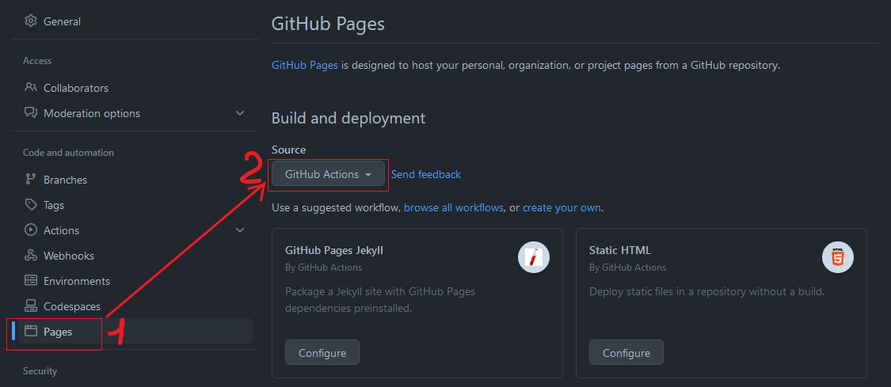

# Vite

## 1. Création d’un projet
Création d’un nouveau projet en utilisant Vite :
```bash
npm create vite@latest
npm cd <projet>
npm i
```

<br/>

## 2. Installation de Vite dans un projet existant
Dans un projet existant, il suffit d’installer le module Vite. D’autres modules peuvent être nécessaires en fonction de l’environnement du projet.

<Tabs groupId="framework">
  <TabItem value="vanilla" label="Vanilla JS" default>
<div class="hide_for_docusaurus">

- Projet Vanilla JS :

</div>

```bash
npm i -D vite
```

  </TabItem>
  <TabItem value="react" label="React & Typescript">
<div class="hide_for_docusaurus">

- Projet React & Typescript :

</div>

```bash
npm i -D vite @vitejs/plugin-react typescript @types/react @types/react-dom
```

  </TabItem>
</Tabs>

<br/>

## 3. Les scripts
Le contenu du fichier `package.json` en fonction du projet :

<Tabs groupId="framework">
  <TabItem value="vanilla" label="Vanilla JS" default>
<div class="hide_for_docusaurus">

- Projet Vanilla JS :

</div>

```json title="package.json"
{
	"scripts": {
		"dev": "vite",
		"build": "vite build",
		"preview": "vite preview"
	}
}
```

  </TabItem>
  <TabItem value="react" label="React & Typescript">
<div class="hide_for_docusaurus">

- Projet React & Typescript :

</div>

```json title="package.json"
{
	"scripts": {
		"dev": "vite",
		"build": "tsc && vite build",
		"preview": "vite preview"
	}
}
```

  </TabItem>
</Tabs>

<br/>

## 4. Le fichier de configuration

Le fichier de configuration est souvent nommé `vite.config.js` :

```javascript title="vite.config.js"
import { defineConfig } from 'vite';

export default defineConfig(({ command, mode, ssrBuild }) => {
	...
})
```

Pour connaitre les options disponibles : [Configuration Vite](https://vitejs.dev/config/)

<br/>

> 💡 Pour permettre d'exécuter le projet sans serveur et donc localement sur son ordinateur, les attributs `type` et `crossorigin` ne doivent pas être générés au niveau des scripts JS dans les fichiers html. Tout cela se passe dans le fichier de configuration :

```javascript title="vite.config.js"
import { defineConfig } from 'vite';

const noAttr = () => {
  return {
    name: "no-attribute",
    transformIndexHtml(html) {
      return html.replace(`type="module" crossorigin`, "");
    }
  }
};

export default defineConfig({
  plugins: [noAttr()]
})
```

<br/>

## 5. Déploiement d’un site statique avec GitHub Pages

Si le déploiement du projet n’est pas à la racine du site (exemple : `https://<username>.github.io/<repo>/`), le fichier de configuration peut être modifié comme ceci :

```javascript title="vite.config.js"
export default {
  base: '/repo/'
}
```

Ou alors, l’option `base` peut être ajoutée directement dans le script du fichier `package.json` :

```json {4} title="package.json"
{
	"scripts": {
    "dev": "vite",
    "build": "vite build --base=/repo/",
    "preview": "vite preview"
  }
}
```

<br/>

Dans l’option "Pages" du projet sur GitHub, choisir la source "GitHub Actions".
<p align="center">

   
</p>

<br/>

Ensuite, le fichier `deploy.yml` est à créer dans le sous-dossier `.github/workflows`. Lors du push des modifications sur GitHub, le déploiement se fera automatique.

```yaml title="deploy.yml"
# Simple workflow for deploying static content to GitHub Pages
name: Deploy static content to Pages

on:
  # Runs on pushes targeting the default branch
  push:
    branches: ['main']

  # Allows you to run this workflow manually from the Actions tab
  workflow_dispatch:

# Sets the GITHUB_TOKEN permissions to allow deployment to GitHub Pages
permissions:
  contents: read
  pages: write
  id-token: write

# Allow one concurrent deployment
concurrency:
  group: 'pages'
  cancel-in-progress: true

jobs:
  # Single deploy job since we're just deploying
  deploy:
    environment:
      name: github-pages
      url: ${{ steps.deployment.outputs.page_url }}
    runs-on: ubuntu-latest
    steps:
      - name: Checkout
        uses: actions/checkout@v3
      - name: Set up Node
        uses: actions/setup-node@v3
        with:
          node-version: 18
          cache: 'npm'
      - name: Install dependencies
        run: npm install
      - name: Build
        run: npm run build
      - name: Setup Pages
        uses: actions/configure-pages@v3
      - name: Upload artifact
        uses: actions/upload-pages-artifact@v1
        with:
          # Upload dist repository
          path: './dist'
      - name: Deploy to GitHub Pages
        id: deployment
        uses: actions/deploy-pages@v1
```

<br/>

## 6. Liens utiles

Documentation : [Guide Vite](https://vitejs.dev/guide/)

<div hidden>

import Tabs from '@theme/Tabs';
import TabItem from '@theme/TabItem';

</div>